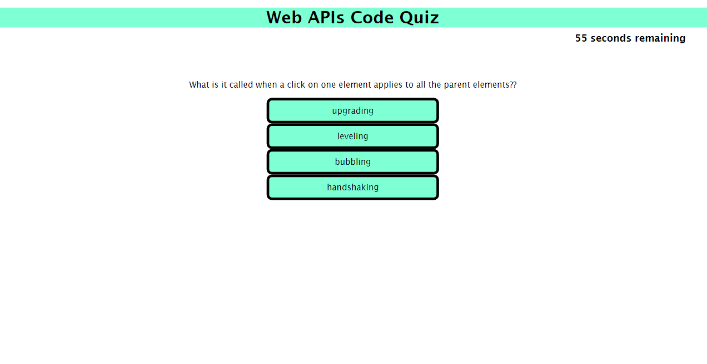
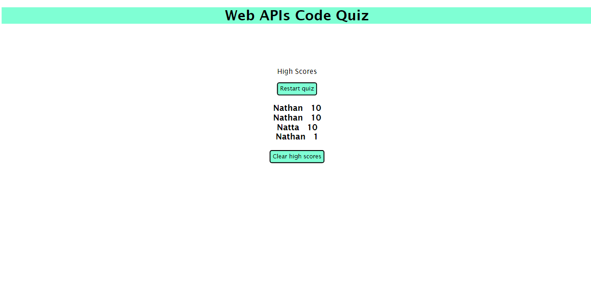

## Challenge 4 - Web APIs Quiz

This program was designed to conduct a quiz on Web APIs as per the requirements of Challenge 4.

Clicking start will initiate the quiz, giving the user 60 seconds to complete it. 

Wrong answers will subtract 5 seconds from the timer. Correct answers will add to the score.

At the end of the quiz, the user has the opportunity to input a name to save along with their score. The program then prints a list of high scores to date, with higher scores at the top, which are saved in the local storage. If the user clicks cancel, the high scores are displayed without adding the new score.

There is also a button to clear the high scores and start anew, which clears the local storage. 

On the high scores page, there is a button to restart the quiz, which will start immediately with questions.

The Github repository is located here: https://github.com/nathanh635/Challenge4-CodingQuiz

The deployed webpage is located here: https://nathanh635.github.io/Challenge4-CodingQuiz/